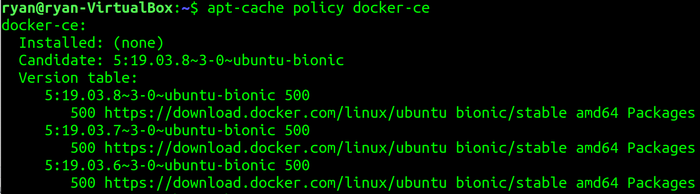
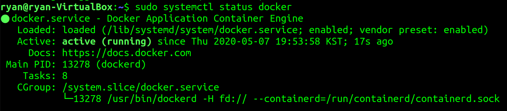

### How to install Docker on Ubuntu 18.04

```
sudo apt update
sudo apt install apt-transport-https ca-certificates curl software-properties-common
curl -fsSL https://download.docker.com/linux/ubuntu/gpg | sudo apt-key add -
sudo add-apt-repository "deb [arch=amd64] https://download.docker.com/linux/ubuntu bionic stable"
sudo apt update
apt-cache policy docker-ce
```

#### Result

</img>

`Installed: (none)` 확인

```
sudo apt install docker-ce
```


#### Check docker running status
```
sudo systemctl status docker
```

</img>
